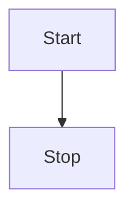
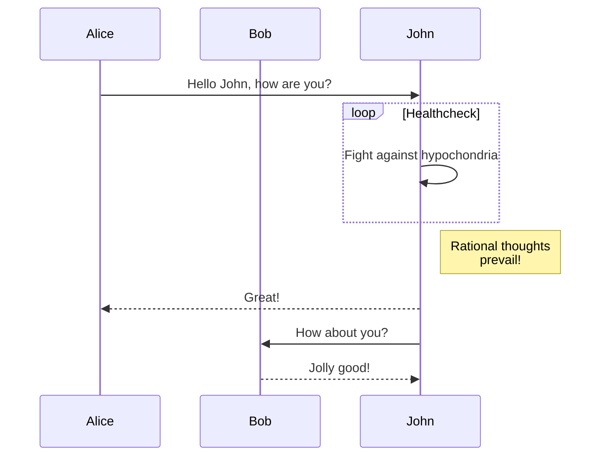

## Tabs
```markdown
    <!-- tabs:start -->
    
    ### **js**
    
    ```javascript
    
    var a = 111
    
    ```
    
    ### **typescript**
    
    ```typescript
    let a: number = 111
    ```
    
    <!-- tabs:end -->
```

- **rendered**

<!-- tabs:start -->

### **java**

```java
int a = 111
```

### **javascript**

```javascript
let a = 111
```
### **python**

```python
if a = 111:
    pass
```

<!-- tabs:end -->

## Vue demo


<div id="main">hello {{ msg }}</div>

<script>
  new Vue({
    el: '#main',
    data: { msg: 'Vue' }
  })
</script>

## Vuep

- **code**

```html
<vuep template="#example"></vuep>

<script v-pre type="text/x-template" id="example">
  <template>
    <div>Hello, {{ name }}!</div>
  </template>

  <script>
    module.exports = {
      data: function () {
        return { name: 'Vue' }
      }
    }
  </script>
</script>
```

- **rendered**

<vuep template="#example"></vuep>

<script v-pre type="text/x-template" id="example">
  <template>
    <div>Hello, {{ name }}!</div>
  </template>

  <script>
    module.exports = {
      data: function () {
        return { name: 'Vue' }
      }
    }
  </script>
</script>

<details>
  <summary>images <small>(memorable)</small></summary>

   <div>hihi</div>
</details>


## Tips

```markdown
?> _TODO_ unit test
```
?> _TODO_ unit test

```markdown
!> **Important** is money, my friend!
```

!> **Important** is money, my friend!
## mermaid
[教程地址](https://mermaid-js.github.io/mermaid/#/)
### 流程图



## emoji
[emoji地址](https://emojipedia.org/)

:100:
💘 ✔️ 🎈 🔮

